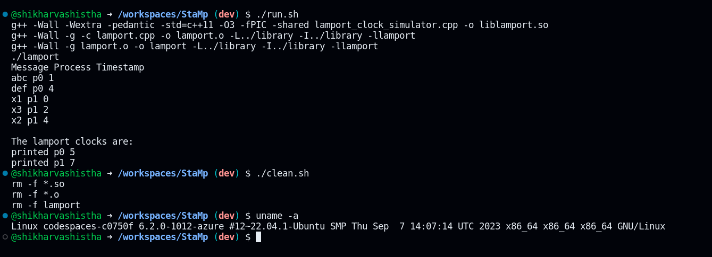

# Lamport’s logical clocks

## How to run the code

<!-- - Go to the libray folder and run the following command to compile the library

```make all```

- Run the following command to link the library in the same folder

```sudo ldconfig```

- Go to the examples folder and run the following command to compile the examples

```make all```

- Go to the working directory and run the following command to set the library path

```export LD_LIBRARY_PATH=$LD_LIBRARY_PATH:$(pwd)/library```

- To clean the library and examples folder run the following command

```make clean```

- How to run object files

```cd examples```
```make run``` -->

<!-- <!--## 2. Shortcut to run the code -->

- Run ```chmod +x run.sh clean.sh``` to make the files executable.

- Run ```run.sh``` file to perform all the operations(Install, compile, link, run) ```[./run.sh]```

- Run ```clean.sh``` file to clean the library and examples folder ```[./clean.sh]``` 

## Sample Input

```
    begin process p1
    send (p2) m1
    print abc
    print def
    end process

    begin process p2
    print x1
    recv p1 m1
    print x2
    send (p1) m2
    print x3
    end process p2
```

## Sample Output


```
Type Process Message Timestamp

begin process p1 p0  0
print abc p2  0
print x1 p1  0
end process p2 p0  0
print x3 p5  0
send (p1) m2 p4  0
print x2 p3  0
begin process p2 p0  0
recv p1 m1 p2  0
end process p0  0
send (p2) m1 p1  0
print def p3  0
system deadlocked
printed p0 0
printed p1 0
printed p2 0
printed p3 0
```



<!-- a  -->

<!-- #!/bin/bash

cd library && make clean && cd ..

cd examples && make clean && cd ..


#!/bin/bash

cd library && make all && sudo ldconfig && cd ..

cd examples && make all && cd ..

export LD_LIBRARY_PATH=$LD_LIBRARY_PATH:$(pwd)/library

cd examples

# Run the examples
make run-fib
make run-matrix
make run-vector -->
